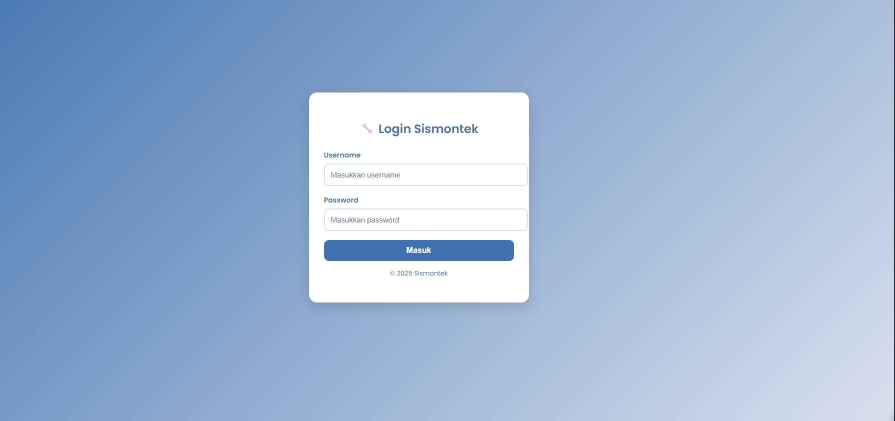
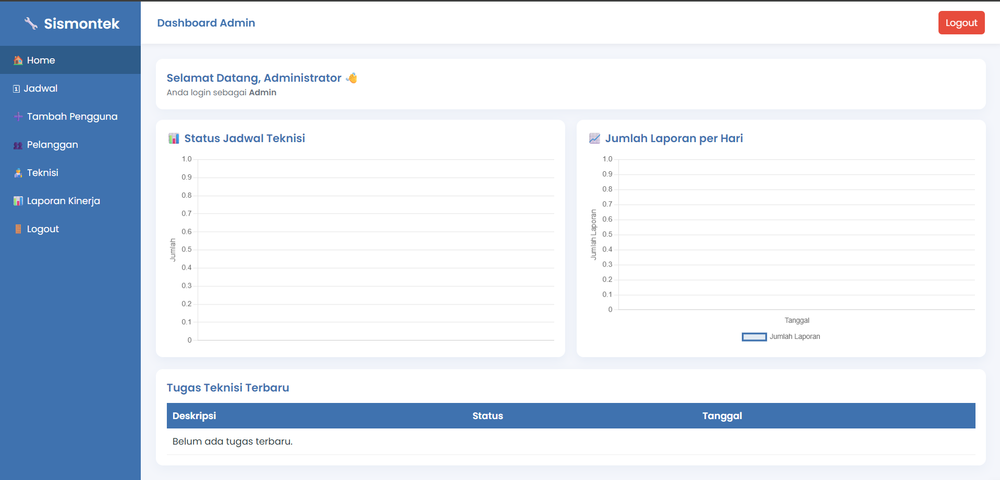
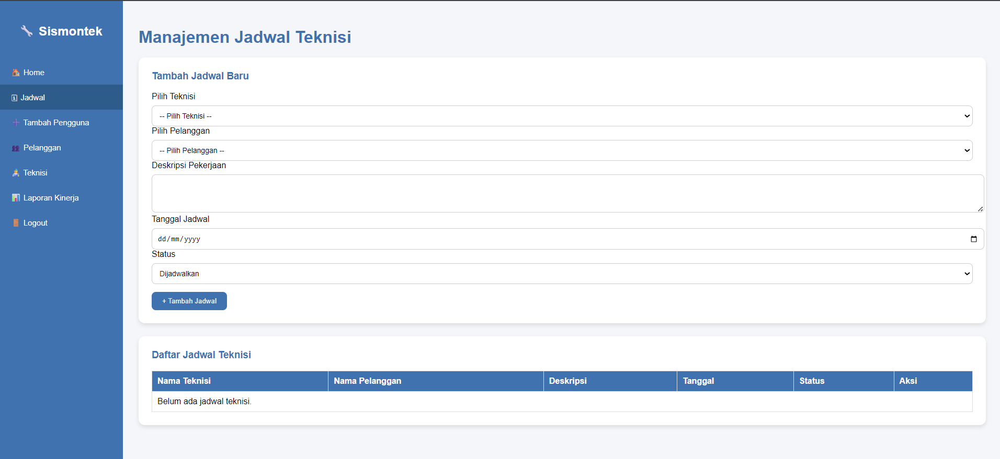

# Sismontek — Sistem Monitoring Kinerja dan Penjadwalan Kerja Teknisi

Aplikasi web berbasis PHP + MySQL untuk mengelola teknisi, pelanggan, penjadwalan pekerjaan, serta monitoring laporan hasil pekerjaan. Proyek ini mendukung tiga peran utama: Admin, Manajer, dan Teknisi.

## Fitur Utama

- Manajemen pengguna dan peran (Admin, Manajer, Teknisi)
- Manajemen teknisi dan pelanggan
- Penjadwalan pekerjaan teknisi (status: dijadwalkan, proses, selesai)
- Pencatatan laporan pekerjaan dengan unggah bukti foto
- Dashboard ringkas per peran
- Cetak/unduh laporan (Manajer)

## Struktur Folder

```
admin/
  dashboard.php
  detail_laporan.php
  jadwal.php
  laporan_chart_data.php
  laporan.php
  pelanggan.php
  tambah_pengguna.php
  teknisi.php
auth/
  login.php
  logout.php
  proses_login.php
database/
  config.php
manajer/
  cetak_laporan.php
  dashboard.manajer.php
teknisi/
  dashboard.teknisi.php
  edit_laporan.php
  form_laporan.php
  proses_laporan.php
uploads/
```

## Prasyarat

- PHP 7.4+ atau 8.x (ekstensi `mysqli` aktif)
- MySQL 5.7/8.0
- Web server (Apache/Nginx) atau PHP built-in server
- Windows (panduan contoh menggunakan PowerShell) — bisa juga di Linux/MacOS

## Konfigurasi Database

Konfigurasi berada di `database/config.php`.

- Default koneksi:
  - Host: `localhost`
  - Username: `root`
  - Password: (kosong)
  - Nama DB: `simontek`
- File ini akan:
  - Membuat database `simontek` jika belum ada
  - Membuat seluruh tabel yang diperlukan
  - Menambahkan akun Admin default

Akun default:

- Username: `admin`
- Password: `admin`

Catatan keamanan: password default disimpan plaintext untuk kemudahan uji coba. Segera ganti password setelah login pertama dan pertimbangkan migrasi ke password hashing (`password_hash`).

## Cara Menjalankan (Pilihan A: PHP Built-in Server)

1. Buka PowerShell, pindah ke folder proyek:

```powershell
Set-Location "c:\Users\ASUS\Documents\UTDI\Semester 5\CAPSTONE PROJECT\Tugas\sistem-monitoring-kinerja-dan-penjadwalan-kerja-teknisi"
```

2. Jalankan server bawaan PHP pada port 8000:

```powershell
php -S localhost:8000 -t .
```

3. Akses aplikasi melalui browser:

- Login: `http://localhost:8000/auth/login.php`

Jika MySQL berjalan secara lokal (mis. via XAMPP/Windows Service) dengan kredensial default, aplikasi akan otomatis membuat database dan tabel saat pertama kali diakses.

## Cara Menjalankan (Pilihan B: XAMPP/Apache)

1. Salin folder proyek ke `C:\xampp\htdocs\simontek` (opsional: gunakan nama folder lain sesuai preferensi).
2. Start `Apache` dan `MySQL` dari XAMPP Control Panel.
3. Buka browser:
   - `http://localhost/simontek/auth/login.php`

Jika ingin mengganti kredensial database, ubah nilai di `database/config.php` lalu restart server/aplikasi.

## Alur Peran

- Admin
  - Kelola pengguna, teknisi, pelanggan
  - Atur jadwal pekerjaan dan memantau laporan
- Manajer
  - Melihat ringkasan dan mencetak laporan
- Teknisi
  - Melihat jadwal pribadi
  - Membuat/memperbarui laporan + unggah bukti foto

## Demo Screenshot

Letakkan file gambar di `docs/screenshots/`, lalu sesuaikan nama file jika berbeda.









Tips: ambil screenshot pada resolusi minimal 1366×768 agar tampilan jelas.

## Upload File

- Bukti foto laporan disimpan di folder `uploads/`
- Pastikan folder dapat ditulis oleh web server
- Jika unggahan gagal karena batas ukuran, sesuaikan `upload_max_filesize` dan `post_max_size` di `php.ini`

## Keamanan & Catatan Teknis

- Autentikasi menggunakan sesi PHP (lihat `auth/`)
- Password default tidak di-hash (untuk demo). Rekomendasi produksi:
  - Hash password: `password_hash` / `password_verify`
  - Validasi input & CSRF protection
  - Pembatasan ukuran/tipe file upload
- Koneksi database menggunakan `mysqli` + prepared statements di proses login

## Troubleshooting

- Gagal konek MySQL: pastikan MySQL aktif dan kredensial di `database/config.php` benar
- Halaman kosong/error: aktifkan error reporting sementara untuk debugging
  ```php
  ini_set('display_errors', 1);
  ini_set('display_startup_errors', 1);
  error_reporting(E_ALL);
  ```
- Upload gagal: cek izin folder `uploads/` dan batasan `php.ini`

## Lisensi

Tidak ditentukan. Jika Anda membutuhkan lisensi, pertimbangkan menambahkan lisensi terbuka (MIT/BSD/Apache-2.0) sesuai kebutuhan.

## Kontribusi

- Fork repo, buat branch feature, lalu kirim Pull Request
- Sertakan deskripsi perubahan dan langkah uji singkat

---

Dibuat untuk membantu operasional penjadwalan dan pemantauan pekerjaan teknisi secara sederhana dan cepat. Selamat mencoba! 🚀
